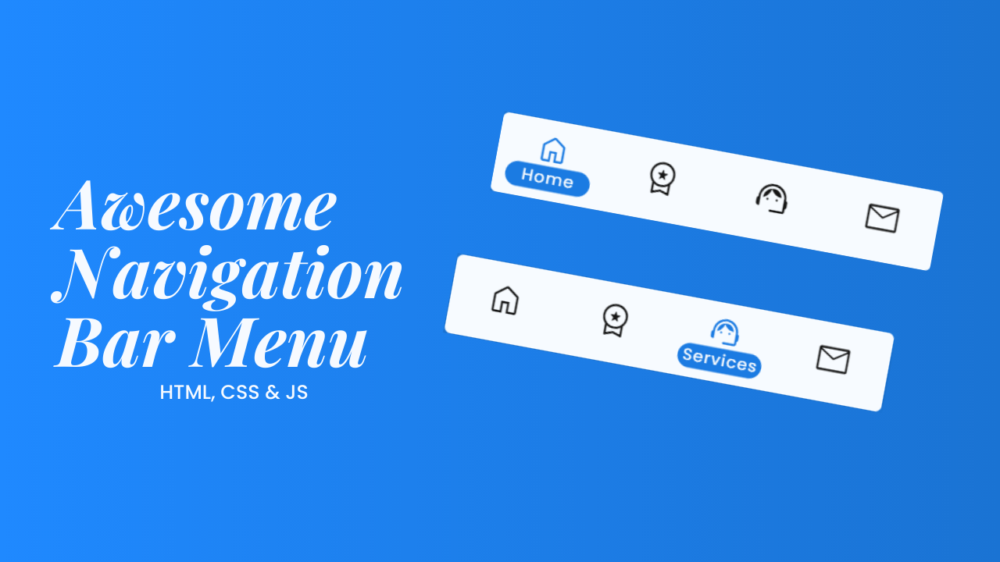

# Awesome Navigation Bar Menu

Build a navigation bar menu using **HTML**, **CSS** & **JavaScript**.

[Watch video on youtube](https://youtu.be/0RWrWHaoZx0 "Navigation Bar Menu")

Video contents:

* Awesome Design
* Add `active` class when scrolling
* Move an element when scrolling or clicking on it
* Responsive Design for mobile devices

Hey bro please don't forget to subscribe to [my channel](https://www.youtube.com/@CodingWeb3 "CodingWeb") and like the [video](https://youtu.be/0RWrWHaoZx0 "Navigation Bar Menu") 😊😊